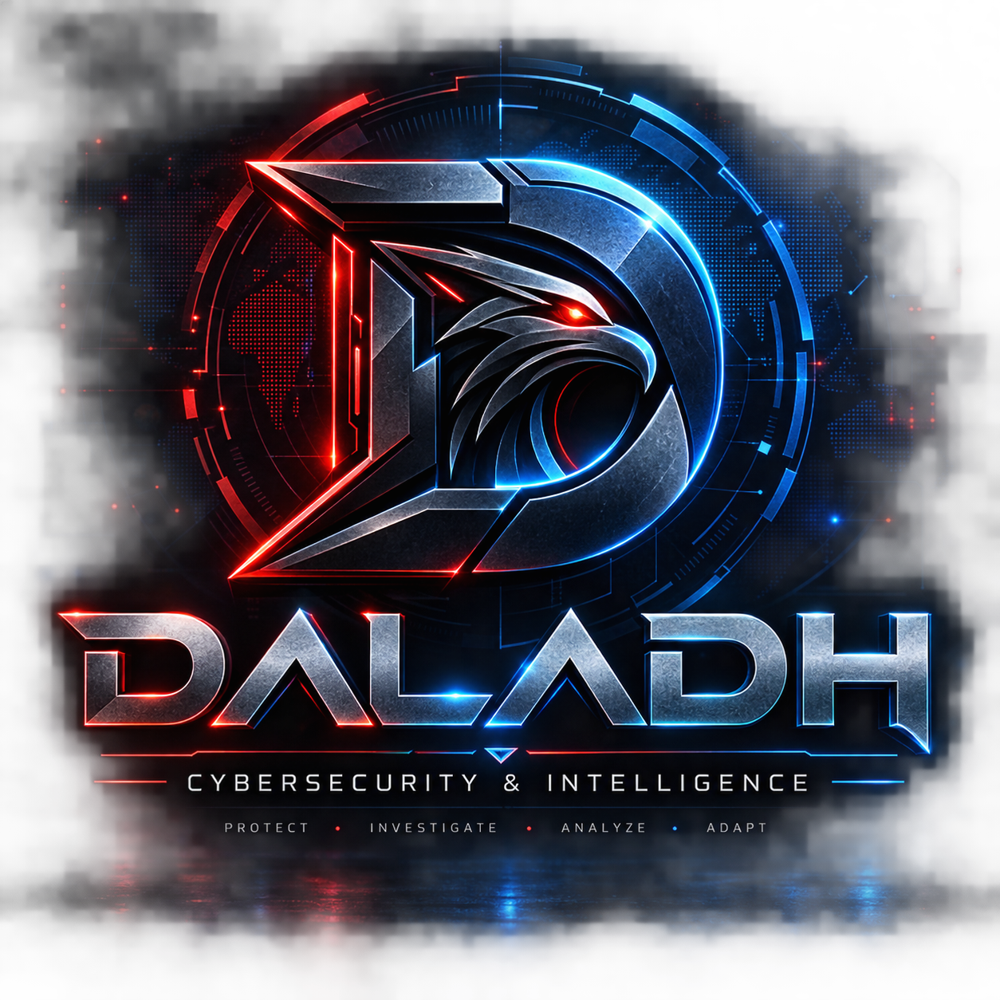

  

<h1 align="center">Hi, I'm Daladh 👋</h1>

  <b>Software Engineer · Cybersecurity & Offensive Security enthusiast</b> 
  Building software and learning to break it — one lab at a time.

  
  
  

---

### 🧑‍💻 About me

I'm a software engineer with a growing focus on **application security** and **offensive security**. I enjoy understanding how systems work — and how they fail. I build projects with clean code and document my security research so others can learn from it too.

- 🔭 Hands-on with web application security: SQL/NoSQL injection, XSS, SSRF, XXE, broken access control and authentication flaws.
- 🧪 I practice on OWASP Juice Shop, PortSwigger Web Security Academy, Hack The Box and TryHackMe.
- 🎯 Goal: become a well-rounded engineer who can both **build secure software** and **assess it**.

---

### 🛠️ Tech & Tools

**Languages**

  
  
  
  
  

**Security & Environment**

  
  
  
  
  

**Training platforms**

  
  
  

---

### 📌 Featured project

**[🧃 OWASP Juice Shop — Security Assessment](https://github.com/Daladh/juice-shop-security-assessment)**
A full web application penetration test: **107 vulnerabilities** documented, with a vulnerability matrix and detailed, reproducible write-ups (SQL injection, forged JWT, XXE, SSRF, NoSQL injection, IDOR). All against a public OWASP training lab, for educational purposes.

---

### 📊 GitHub stats

  
  

---

<i>More projects coming soon — building step by step. 🚀</i>

